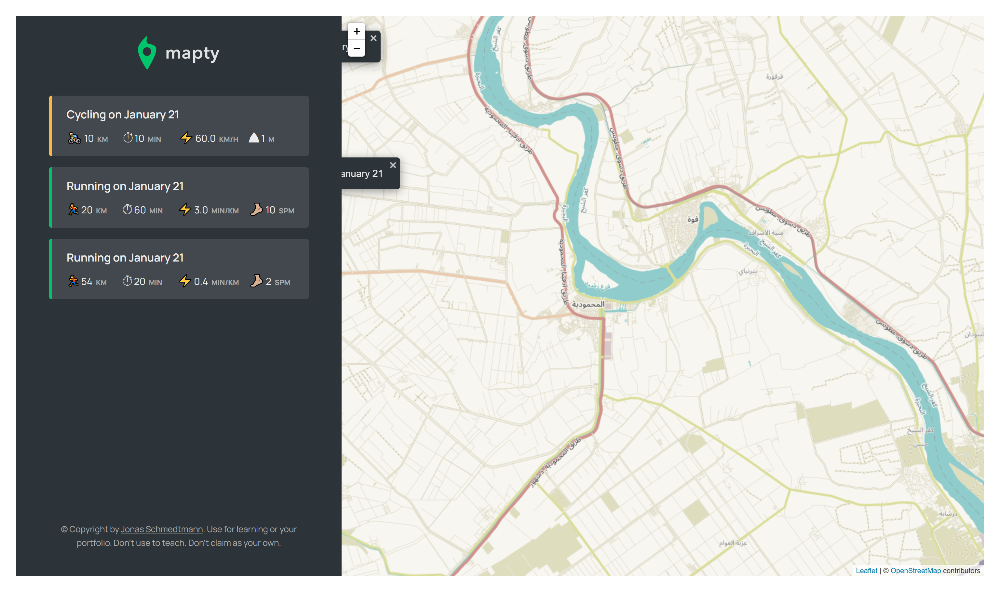

# Mapty - Fitness Tracker App

Mapty is a fitness tracking application that allows users to log workouts such as running or cycling, view the details of each workout, and see them displayed on an interactive map. The app is built with **HTML**, **CSS**, and **JavaScript**, and utilizes **Leaflet.js** to embed maps for workout tracking.

## Screen shot

## Features

- **Track Workouts**: Add running or cycling workouts with details such as distance, duration, and pace.
- **Interactive Map**: View your workouts on an interactive map using **Leaflet.js**.
- **Responsive Design**: The app is responsive, ensuring a great user experience on both desktop and mobile devices.
- **Workout Filtering**: View workouts based on their type (running or cycling).
- **Local Storage**: Workouts are saved in the browser’s local storage, ensuring data persists even after the page is reloaded.

## Technologies Used

- **HTML**: For the structure and layout of the app.
- **CSS**: For styling and making the app responsive.
- **JavaScript**: For handling user interactions, form validation, and manipulating the map.
- **Leaflet.js**: A lightweight JavaScript library for embedding interactive maps.
- **LocalStorage API**: To save and retrieve workout data locally in the browser.

## How to Use

1. Enter the details of your workout (e.g., distance, duration, type).
2. Click the "Add Workout" button to log your workout.
3. View your workouts on the map and see their details.
4. The app saves your workout data locally, and you can filter workouts by type.
